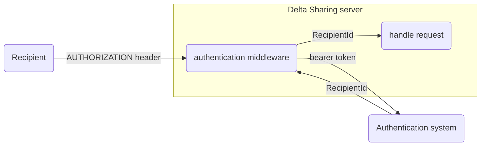

# Authentication

In order to serve the correct data, the Delta Sharing server needs to identify the recipient that is making a request to the server. Once the recipient is identified, the server can serve the shares, schemas and tables that the identified recipient has access to.

In order to identify the recipient, the Delta Sharing server makes use of [bearer tokens](https://datatracker.ietf.org/doc/html/rfc6750) as described in the [Delta Sharing protocol](https://github.com/delta-io/delta-sharing/blob/main/PROTOCOL.md). The provider of the shared data assets is responsible for registering these assets in the Delta Sharing server and configuring which recipients have access to these shares. The provider is also responsible for registering new recepients and distributing so-called [Delta Sharing profile files](https://github.com/delta-io/delta-sharing/blob/main/PROTOCOL.md#profile-file-format) to recepients. These profiles contain the details for the recipient to connect to the Delta Sharing server.

The Delta Sharing protocol does not specify how these tokens should be generated, or how they would be mapped to registered recipients. Every Delta Sharing server is free to implement middleware that handles authentication in the way that best serves the specific use case. 

This crate provides some ready-to-use authentication middleware, but also allows developers to implement a customized authentication solution.

## Recepients

By recipient we mean the consumer of a given share. Within the Delta Sharing server, the recipient will be identified using the `RecipientId` type. The `RecipientId` can either contain a identifier in the form of a string or set to the anonymous variant. Using the `RecipientId` the server can determine which assets a recipient has access to. Whenever a share provider allows access to the anonymous recipient, the share in essence becomes a public share.

## Public shares

The easiest way to implement authentication for the Delta Sharing server is to allow all recipients access to all shares. Technically this would mean that `RecipientId::Anonymous` has access to the share and that the authentication mechanism would allow unauthenticated requests.

This crate provides authentication middleware to build a Delta Sharing server, but it is also possible to bring your own authentication middleware.