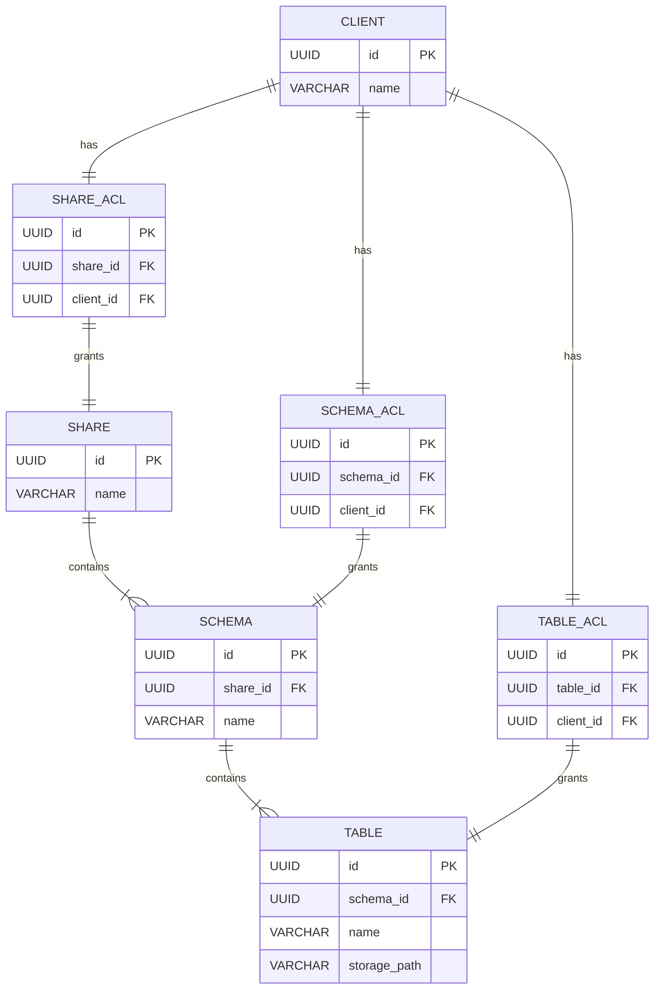

postgres based share reader

The following ERD diagram describes the Postgres database

```mermaid
erDiagram
    SHARE ||--|{ SCHEMA : contains
    SHARE {
        UUID id PK
        VARCHAR name
    }
    SCHEMA {
        UUID id PK
        UUID share_id FK
        VARCHAR name
    }
    SCHEMA ||--|{ TABLE : contains
    TABLE {
        UUID id PK
        UUID schema_id FK
        VARCHAR name 
        VARCHAR storage_path
    }
    CLIENT {
        UUID id PK
        VARCHAR name
    }
    SHARE_ACL {
        UUID id PK
        UUID share_id FK
        UUID client_id FK
    }
    CLIENT ||--|| SHARE_ACL : has
    SHARE_ACL ||--|| SHARE : grants
    SCHEMA_ACL {
        UUID id PK
        UUID schema_id FK
        UUID client_id FK
    }
    CLIENT ||--|| SCHEMA_ACL : has
    SCHEMA_ACL ||--|| SCHEMA : grants
    TABLE_ACL {
        UUID id PK
        UUID table_id FK
        UUID client_id FK
    }
    CLIENT ||--|| TABLE_ACL : has
    TABLE_ACL ||--|| TABLE : grants
```